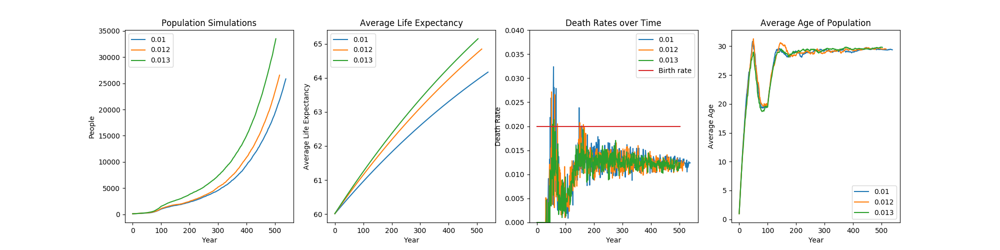

# birth-death

Simulation of a population's growth over time, tracking factors using factors such as birth rate and a modelled increase in health, tracking factors including death rate and total population count.

## Tracking an Aging Population

Original blog post:
https://plaee.wordpress.com/2020/10/02/why-the-population-is-aging/

A recent article in the Times [1], shows that many countries are trying to decrease the average age in their country since demographic trends show that the average age is going up. This, of course, puts a strain on the workforce as what is called the old-age dependency ratio [2] is increasing as the ratio of working-age people to pensioners increases.

Several countries have tried solving the problem through 2 methods:

1. Increasing immigration.
2. Incentives for births.

These produce an influx of working-age people.
In general, the demographic ratios are dictated by the link between the birth rate and the death rate [3].
What that article fails to examine is the long term effect of the low birth rate: namely, decreasing the death rate. In fact, the true cause of changing population demographics is the rate of change in the birth rate. Should the birth rate suddenly drop, the death rate will also begin to increase, as fewer new babies result in more deaths per capita as people reach an age of mortality.
However, instantaneously, greater life expectancy and better health provisions can artificially decrease the death rate, resulting in a birth rate that is smaller than the death rate, and increasing average age. But of course, what goes up must come down, and once improvements in life expectancy slow down, the death rate will increase.

## Simulation

I simulated the population and changed the birth rate to twice what it was after 50 years. I then switched it back after 100 years, and we see that the population is only tied to the birth rate, without much dependence on the average life expectancy.
Average life expectancy increasing doesn\’t affect much since obviously pension age would increase too, proportional to the average life expectancy! So the same percentage of people in the workforce results.
Note that if we assume that it is not just people living longer, but also the chronological age of people being stretched out, then improved health is a good argument for increasing the pension age.

## Conclusion

Average life expectancy increases the rate of population growth, but the average age is almost entirely determined by the birth rate per capita.
The simulation also successfully predicts the average age of the world population to a reasonable degree. This may be due to the average life expectancy.

### References

[1] https://www.thetimes.co.uk/edition/world/europe-turns-to-benefits-and-migration-to-boost-birth-rates-ml850zmp2

[2] https://www.ons.gov.uk/peoplepopulationandcommunity/populationandmigration/migrationwithintheuk/articles/thechangingukpopulation/2015-01-15

[3] https://pdfs.semanticscholar.org/1260/91f6e25fb3429fd48bf1a8d85fcbc87526f4.pdf
